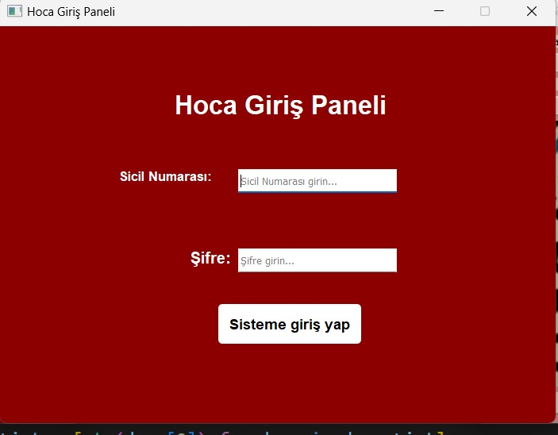
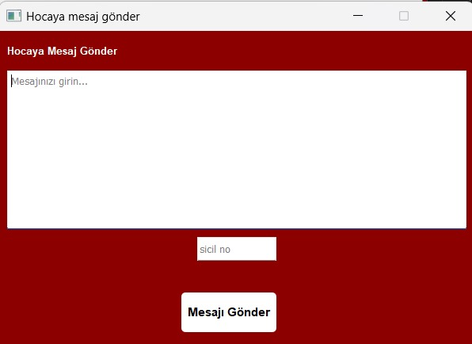

# Student Information System

This project is a comprehensive student information system that manages various operations such as student registration, course management, and communication within the system.

## Screenshots

Below are some UI components of the system:

- Admin Login
  

- List Students
  

- Formula
  

- Academician Login
  

- Academician Panel
  

- Add Area of Interest Panel
  

- Send Student Message Panel
  

- Student Login
  

- Student Panel
  

- Send Request
  

- My Requests
  

- Transcript View
  

## Installation

To setup the project locally, make sure you have [Python](https://www.python.org/downloads/) installed. 

### Requirements

Install the necessary libraries using pip:

```bash
pip install psycopg2-binary
pip install PyQt5
pip install pymupdf